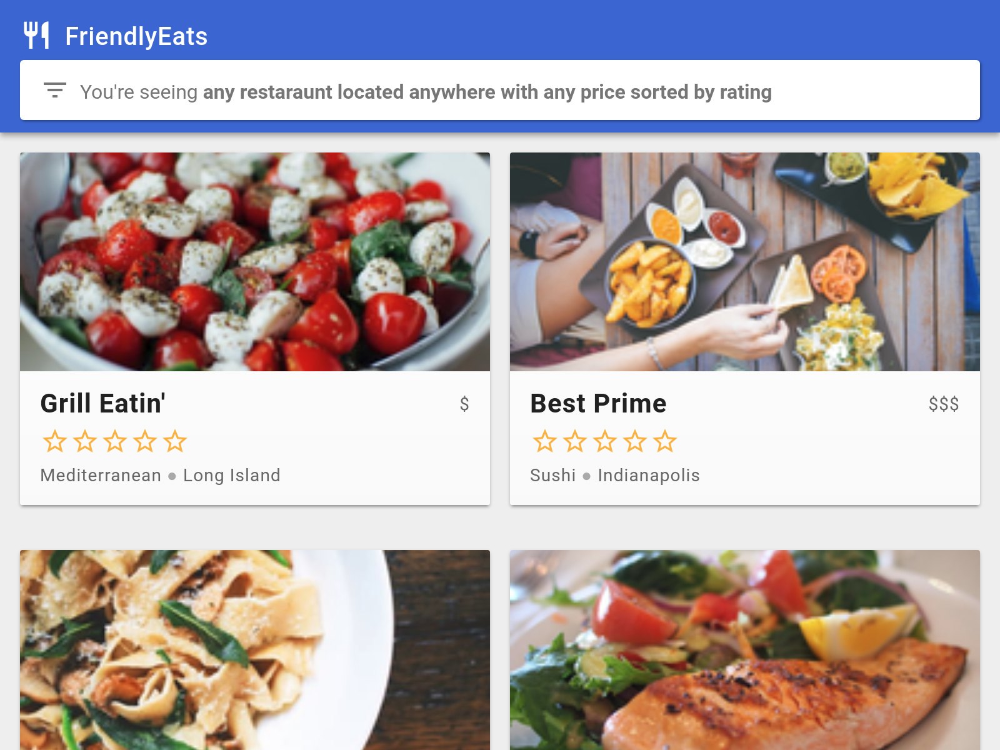

# FriendlyEats (Web)

## Introduction

FriendlyEats is a restaurant recommendation app built on Cloud Firestore.
For more information about Firestore visit [the docs][firestore-docs].

This project is the starting point for the [Cloud Firestore Web Codelab][codelab],
which will show you how to build the applications step-by-step. If you'd like to
simply run the finished result, see the [quickstart app][quickstart].

## Setup

Follow the [Cloud Firestore Web Codelab][codelab] to set up this sample.

## License

© Google, 2018. Licensed under an [Apache-2](./LICENSE) license.

## Build Status

[codelab]: https://codelabs.developers.google.com/codelabs/firestore-web
[quickstart]: https://github.com/firebase/quickstart-js/tree/master/firestore
[firestore-docs]: https://firebase.google.com/docs/firestore/

## STEPS:

1. Create project
2. enable anonymous signin
3. enable firestore in test mode
4. git clone repository
5. npm install in friendlyeats-web directory
6. terminal: firerbase login
7. terminal: firebase use --add
choose the project and use as `default` environment
8. firebase serve --only hosting
9. open browser and add restaurants (nothing happens)
10. enable add restaurant function (data will be in console but not on web)
11. enable getRestaurants function (data will be visible)
12. single item is not able to open (enable getDocumentsInQuery and getRestaurant)
13. add filteration (enable getFilteredRestaurants)
14. enable addRating (add mock data and custom data and show it on console)
15. if have time firebase deploy

## Happy Coding